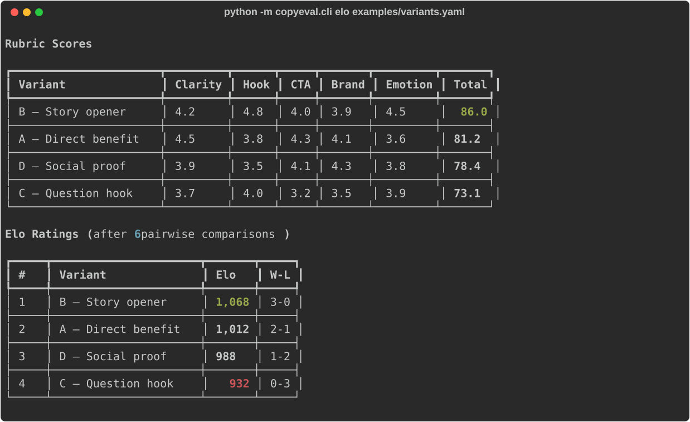

# Marketing Copy Eval Harness

LLM-as-judge for marketing copy — score variants on a configurable rubric (clarity, hook, CTA, brand fit, emotion), run pairwise comparisons with Elo ratings, get structured verdicts with reasoning.

[](LICENSE)
[](https://www.python.org/downloads/)

> ⚠️ **Disclaimer:** LLM-based evaluation is a signal, not ground truth. Use alongside human review and A/B testing.



## Features

- **Rubric scoring** — 5 criteria with weights, structured JSON output, averaged over N rounds
- **Pairwise Elo** — all-pairs comparisons + Elo rating (more robust than single-shot scores)
- **Rich reports** — terminal tables with per-criterion scores, rankings, and one-line verdicts
- **Configurable** — custom criteria via `rubric.py` or Python's `load_rubric` function

## Install

```bash
pip install -e .
```

## Quickstart

### 1. Configure API key

```bash
cp .env.example .env
# Add your ANTHROPIC_API_KEY to .env
```

### 2. Prepare variants

Create a YAML file with your copy variants (see `examples/variants.yaml`):

```yaml
variants:
  - id: "A"
    label: "Direct benefit"
    text: "Cut reporting time by 80%. One dashboard, every metric."
  - id: "B"
    label: "Story opener"
    text: "Last quarter, our team spent 200 hours on reports. Then we found a better way."
  - id: "C"
    label: "Question hook"
    text: "What if your entire team could access real-time metrics without a single spreadsheet?"
```

### 3. Run evaluation

```bash
# Rubric scoring — each variant scored on 5 criteria
python -m copyeval.cli score examples/variants.yaml

# Average three independent rounds (three API calls per variant)
python -m copyeval.cli score examples/variants.yaml --rounds 3

# Pairwise Elo — all-pairs head-to-head comparisons
python -m copyeval.cli elo examples/variants.yaml

# Dry run (show prompts without calling API)
python -m copyeval.cli score examples/variants.yaml --dry-run
```

### Example Output

The rubric scorer rates each variant on Clarity, Hook, CTA, Brand Fit, and Emotion (0-10 scale), then computes a weighted total. The Elo mode uses a base rating of 1500 and K=32. The illustrative ranking below is not measured performance:

```
Elo Ratings (after 6 pairwise comparisons)

  #   Variant                Elo    W-L
  1   B — Story opener      1,568   3-0
  2   A — Direct benefit    1,512   2-1
  3   D — Social proof      1,488   1-2
  4   C — Question hook     1,432   0-3
```

## How It Works

1. **Rubric scoring** sends each variant + rubric criteria to Claude, requesting structured JSON with per-criterion scores (0-10) and reasoning. Scores are averaged over N rounds; displayed reasoning and summary come from the final round.

2. **Pairwise Elo** presents every pair of variants to the judge, asking "which is better and why?" Results feed into an Elo rating system (K=32, base 1500). Results depend on comparison order; the CLI uses input order.

3. Both modes produce **structured verdicts** — the LLM must return valid JSON with scores, reasoning, and a one-line verdict. This prevents vague "both are good" responses.

## Architecture

```
src/copyeval/
├── cli.py       # Typer CLI: score / elo commands
├── client.py    # Anthropic API wrapper
├── judge.py     # Prompt construction + response parsing
├── rubric.py    # Default rubric criteria + weights
├── pairwise.py  # Pair generation, Elo computation
└── models.py    # Pydantic models for verdicts
```

## Roadmap

- [ ] Custom rubric via YAML config
- [ ] Confidence intervals for multi-round scores
- [ ] HTML report export
- [ ] A/B test result integration

## Testing

```bash
pip install -e ".[test]"
python -m pytest
```

Tests use mocked judge responses and do not make paid API calls.

## License

MIT
